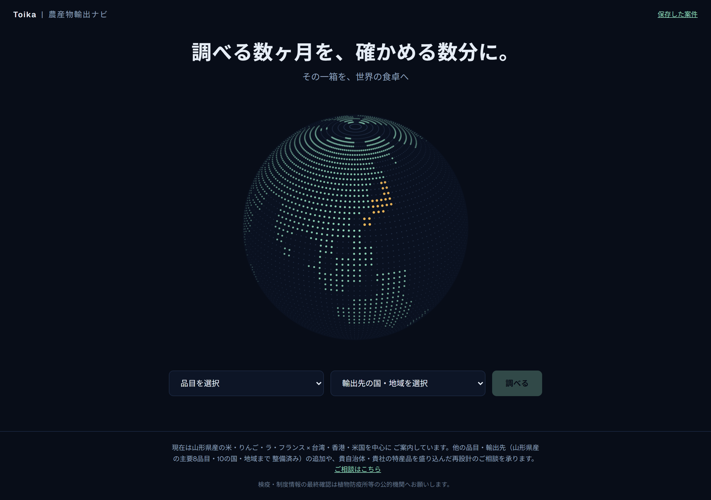
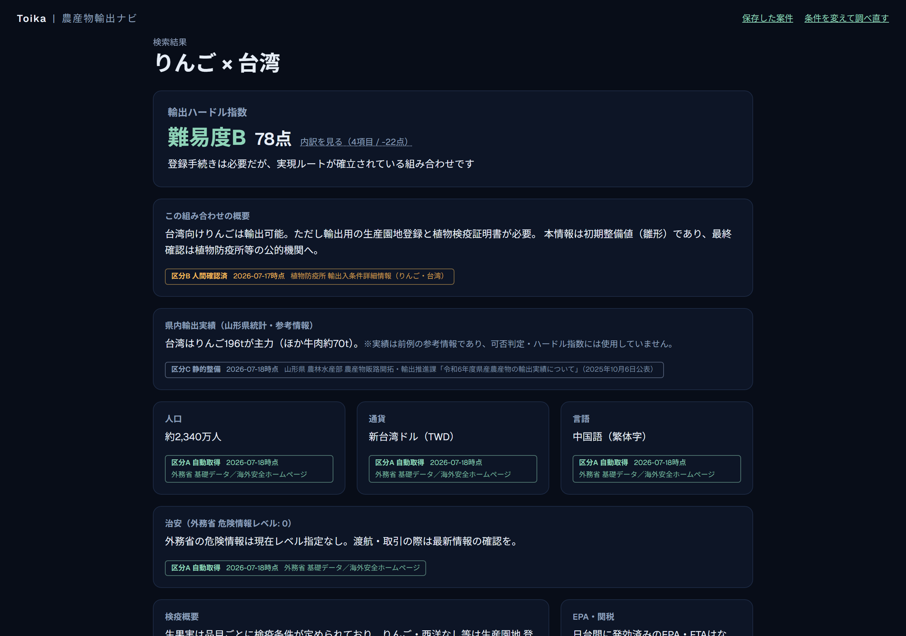
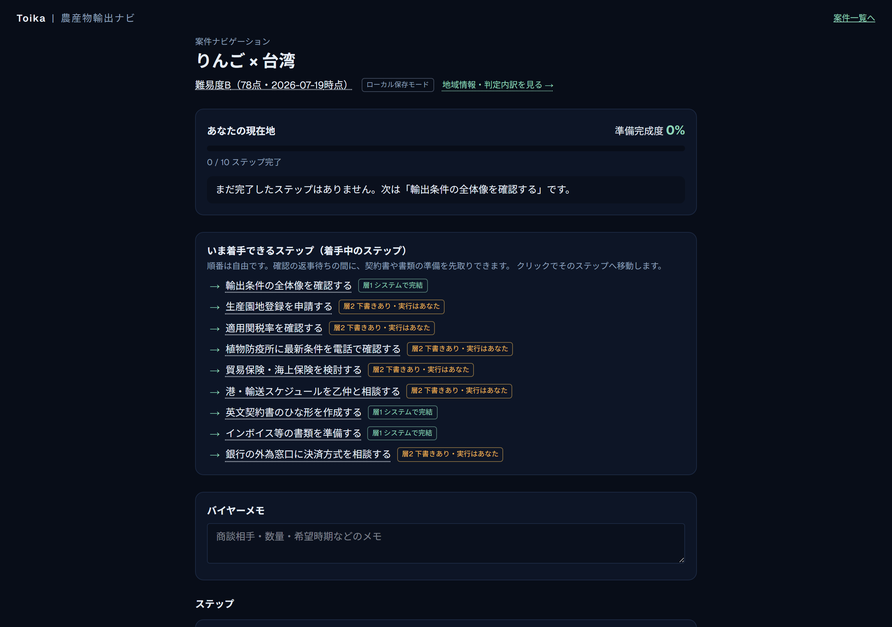

# 農産物輸出ナビ（Toika Export Navigator）

「調べる数ヶ月を、確かめる数分に。」

品目と国を選ぶだけで、農産物輸出の可否と難易度（輸出ハードル指数）、
減点内訳と対処案、必要な手続きのステップを数分で確認できるサイトです。
山形県に輸出実績のある主要8品目（米・りんご・ラ・フランス・もも・柿・
ぶどう・メロン・さくらんぼ）× 10の国・地域に対応しています。
組み合わせによっては「情報整備中」のものがあります — 未確認の情報を
推測で表示しない方針のためで、整備のご要望はいつでも歓迎です。

現在は山形県の代表的な農産物をターゲットにしていますが、山形県の品目や
輸出先を増やすことも、山形県以外の農産物に広げることも仕組みとしては
可能です。現段階では無料での提供を続けるために対象の枠を絞っていますが、
「この品目・この国を調べたい」というご要望があれば、お気軽にご相談ください。

**公開サイト: https://agri-export-navi.vercel.app**

## 画面イメージ

品目と輸出先を選ぶ（トップ画面の点描地球儀）

輸出ハードル指数・減点内訳・鮮度バッジ・国概要（検索結果画面：りんご × 台湾＝難易度B 78点）

案件を保存して手続きをナビゲート（着手できるステップ・準備完成度・3層バッジ）

## 製作者の考え方

このアプリの趣旨は、あちこちに散らばっている輸出関連の情報を一つにまとめ、
可能な限り新しい状態でお届けすることで、輸出に挑戦される方を最大限
サポートすることです。最終的なご確認の責任は輸出される方ご自身にありますが、
調べものの煩わしさを少しでも取り除き、微力ながらお役に立てれば幸いです。

- **無料で、どなたでも使えます。** 現時点では山形県の代表的な品目に
  限っていますが、輸出に興味のある方が自由に試し、現場の声で育てて
  もらうことを目指しています。お探しの農産物がまだ無い場合でも、
  一度「りんご × 台湾」などでお試しいただければ、本アプリの使い勝手を
  実感していただけると思います
- **会員登録・ログインはありません。** ユーザー管理を設けると使い勝手を
  落とすと考え、意図的にこの設計にしています。個人情報はお預かりしません
- その半面、**保存した案件はお使いの端末（ブラウザ）の中にだけ**残ります。
  PCとスマホの間でデータは共有されません。ブラウザの閲覧データを削除すると
  案件も消えます
- 検疫・制度の情報は誠実に保守しますが、**最終確認は必ず植物防疫所等の
  公的機関へ**お願いします。本サイトは判断の下調べを速くする道具です
- **輸出の実務は幅広く、本サイトがすべての手続き・確認事項を網羅している
  ことを保証するものではありません。** 「この確認も必要では？」という
  現場の気づきこそが本サイトを育てます。お気づきの点はぜひ教えてください。
  2〜3日を目安に反映します

## 使い方（3分）

1. トップで品目と国を選ぶ（例: りんご × 台湾）→ 地球儀が回って結果へ
2. 結果画面でハードル指数（100点からの減点方式・A〜E）と減点内訳、
   鮮度バッジ（情報の取得時期）を確認
3. 「この内容でナビゲートを始める」で案件として保存 → ステップナビへ
4. ナビでは、いま着手できるステップ・官庁確認ゲート・準備完成度が見えます。
   各ステップから書類ツール（英文契約書ひな形・インボイス/PL・港選定→
   乙仲リスト→相談メール下書き・銀行チェックリスト）が開けます
5. 保存後に輸出関連情報へ変更があった場合は、ナビ上部にお知らせが出ます

---

※ 本サイトの検疫・制度情報は運用者が確認のうえ整備していますが、内容の
正確性・網羅性を保証するものではありません。最終確認は植物防疫所等の
公的機関へ。
